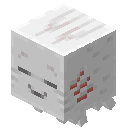

<a herf="https://github.com/Data708983/Keep_Ghastling">
  <p align="center"></p>
</a>
<p align="center">Keep ghastling maintaining its juvenile state</p>

<h1 align="center">
Keep_Ghastling
</h1>

<p align="center">
    Give us a star if you like this!
</p>

<p align="center">
  <a href="https://github.com/Data708983/Keep_Ghastling/releases"></a>
  <a href="#"></a>
  <a href="#"></a>
  <a href="#"></a>
</p>
<p align="center">
  <a href="#"></a>
</p>


## Introduction
**Keep_Ghastling** is a paper plugin that keeps ghastling maintaining its juvenile state.

## Features
- Use **ice blocks** on the Happy Ghastling to fix its juvenile state
- Use **Magma Cream** on a Happy Ghastling to release it from being fixed

## Building

Feel free to build it yourself when you'd like to try the latest version.

Gradle is required to build the project.


```sh
gradle build
```

---
